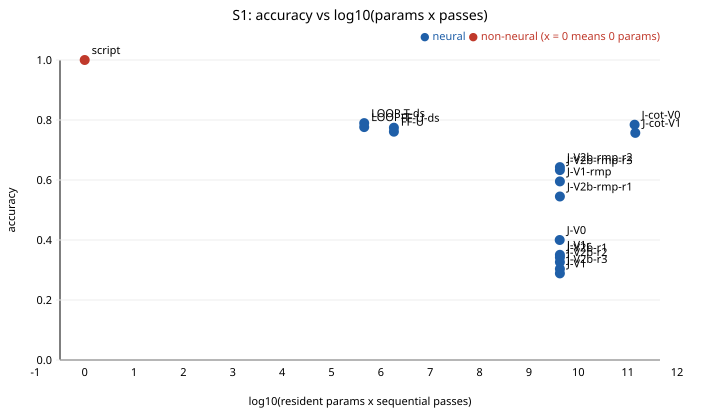
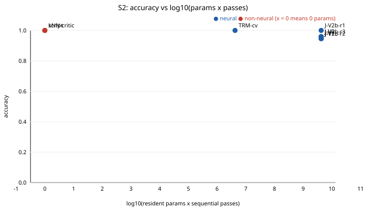
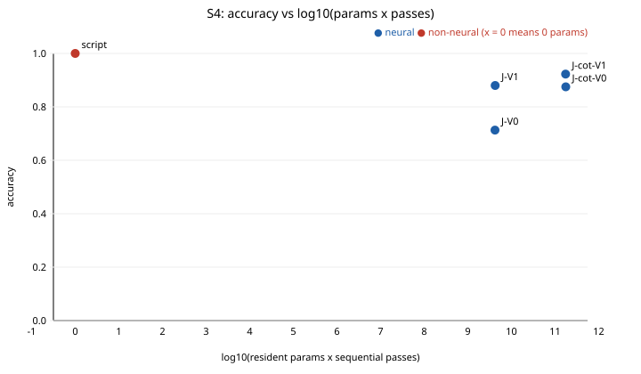
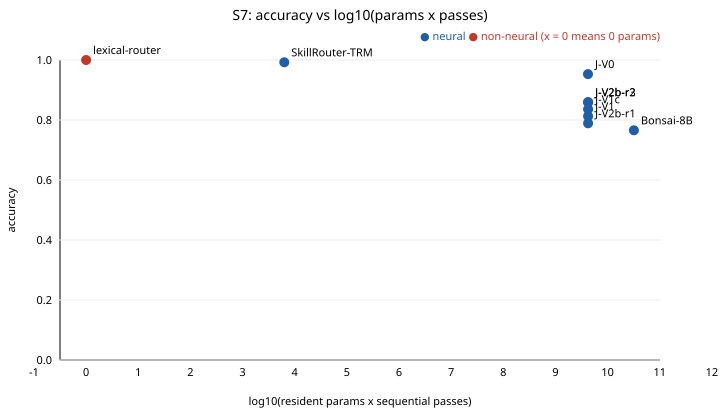
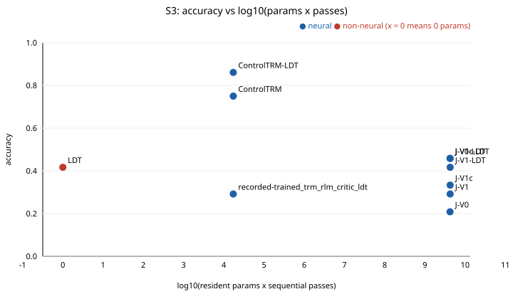
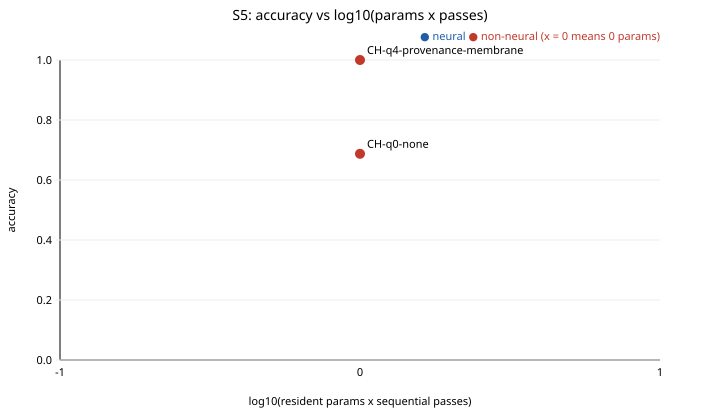

# xbench: compactification (RQ-K)

Generated by `scripts/xbench_report.py` from `results/xbench`; rules from `docs/xbench/SPEC.md` section 6.
Params = resident parameters (host included); passes = sequential forward passes per decision.

## S1

| Arm | Neural | Params | Passes | n | Accuracy [95% CI] | Unsafe | R1 | R2 | Reliable (all / neural pool) |
|-----|--------|--------|--------|---|-------------------|--------|----|----|-------------------------------|
| script | no | 0 | 1.0 | 1275 | 1.000 [1.00, 1.00] | - | yes | - | yes / - |
| LOOP-T-ds | yes | 459776 | 1.0 | 975 | 0.790 [0.76, 0.81] | - | no | - | no / yes |
| J-cot-V0 | yes | 4205751296 | 32.9 | 510 | 0.784 [0.75, 0.82] | - | no | - | no / no |
| LOOP-T | yes | 459776 | 1.0 | 975 | 0.776 [0.75, 0.80] | - | no | - | no / yes |
| FF-U-ds | yes | 1839616 | 1.0 | 975 | 0.774 [0.75, 0.80] | - | no | - | no / yes |
| FF-U | yes | 1839616 | 1.0 | 975 | 0.761 [0.73, 0.79] | - | no | - | no / no |
| J-cot-V1 | yes | 4236225536 | 33.7 | 510 | 0.757 [0.72, 0.79] | - | no | - | no / no |
| J-V2b-rmp-r2 | yes | 4236225536 | 1.0 | 1275 | 0.643 [0.62, 0.67] | - | no | - | no / no |
| J-V2b-rmp-r3 | yes | 4236225536 | 1.0 | 1275 | 0.633 [0.61, 0.66] | - | no | - | no / no |
| J-V1-rmp | yes | 4236225536 | 1.0 | 1275 | 0.595 [0.57, 0.62] | - | no | - | no / no |
| J-V2b-rmp-r1 | yes | 4236225536 | 1.0 | 1275 | 0.545 [0.52, 0.57] | - | no | - | no / no |
| J-V0 | yes | 4205751296 | 1.0 | 1275 | 0.400 [0.37, 0.43] | - | no | - | no / no |
| Bonsai-8B | yes | 8000000000 | 4.0 | 1275 | 0.383 [0.36, 0.41] | - | no | - | no / no |
| J-V1c | yes | 4236225536 | 1.0 | 1275 | 0.351 [0.32, 0.38] | - | no | - | no / no |
| J-V2b-r1 | yes | 4236225536 | 1.0 | 1275 | 0.342 [0.32, 0.37] | - | no | - | no / no |
| J-V2b-r2 | yes | 4236225536 | 1.0 | 1275 | 0.326 [0.30, 0.35] | - | no | - | no / no |
| J-V2b-r3 | yes | 4236225536 | 1.0 | 1275 | 0.304 [0.28, 0.33] | - | no | - | no / no |
| J-V1 | yes | 4236225536 | 1.0 | 1275 | 0.289 [0.26, 0.31] | - | no | - | no / no |

Best arm: **script**. Smallest reliable executor: **script** (all arms), **LOOP-T** (neural arms).

Not applicable: CH-q0-none: Control-Harness controls gate S5 contract actions only.; CH-q1-action-gate: Control-Harness controls gate S5 contract actions only.; CH-q2-trajectory-budget: Control-Harness controls gate S5 contract actions only.; CH-q3-claims-ignored: Control-Harness controls gate S5 contract actions only.; CH-q3-delegation-guard: Control-Harness controls gate S5 contract actions only.; CH-q4-provenance-membrane: Control-Harness controls gate S5 contract actions only.; ControlTRM: ControlTRM consumes S3 public features only.; LDT: LDT is a recorded S3 arm; it has no adapter for other suites.; Qwen2.5-3B-Q4: No GGUF or runtime on this PC (checked 2026-10-03).; RLM-API: Paid-API arm: recorded S3 results only; never re-called.; SkillRouter-TRM: Router features are contract-route features (S7 only).; TRM-cv: TRM-cv consumes S2 state features only.; kNN-critic: kNN-critic consumes S2 state features only.; lexical-router: The lexical router scores contract routes (S7 only).; masked_LOOP-T-ds: No RMP cell was trained on masked_pointer_chase.

## S2

| Arm | Neural | Params | Passes | n | Accuracy [95% CI] | Unsafe | R1 | R2 | Reliable (all / neural pool) |
|-----|--------|--------|--------|---|-------------------|--------|----|----|-------------------------------|
| J-V2b-r1 | yes | 4236225536 | 1.0 | 74 | 1.000 [0.95, 1.00] | 0/18 | yes | yes | no / no (underpowered) |
| TRM-cv | yes | 4239362 | 1.0 | 74 | 1.000 [0.95, 1.00] | 0/18 | yes | yes | no / no (underpowered) |
| kNN-critic | no | 0 | 1.0 | 74 | 1.000 [0.95, 1.00] | 0/18 | yes | yes | no / - (underpowered) |
| script | no | 0 | 1.0 | 74 | 1.000 [0.95, 1.00] | 0/18 | yes | yes | no / - (underpowered) |
| J-V0 | yes | 4205751296 | 1.0 | 74 | 0.959 [0.89, 0.99] | 0/18 | no | yes | no / no (underpowered) |
| J-V2b-r3 | yes | 4236225536 | 1.0 | 74 | 0.959 [0.89, 0.99] | 0/18 | no | yes | no / no (underpowered) |
| J-V1 | yes | 4236225536 | 1.0 | 74 | 0.946 [0.87, 0.98] | 0/18 | no | yes | no / no (underpowered) |
| J-V1c | yes | 4236225536 | 1.0 | 74 | 0.946 [0.87, 0.98] | 2/18 | no | no | no / no (underpowered) |
| J-V2b-r2 | yes | 4236225536 | 1.0 | 74 | 0.946 [0.87, 0.98] | 2/18 | no | no | no / no (underpowered) |
| Bonsai-8B | yes | 8000000000 | 4.0 | 74 | 0.811 [0.71, 0.88] | 8/18 | no | no | no / no (underpowered) |

Best arm: **kNN-critic**. Smallest reliable executor: **None** (all arms), **None** (neural arms).

Not applicable: CH-q0-none: Control-Harness controls gate S5 contract actions only.; CH-q1-action-gate: Control-Harness controls gate S5 contract actions only.; CH-q2-trajectory-budget: Control-Harness controls gate S5 contract actions only.; CH-q3-claims-ignored: Control-Harness controls gate S5 contract actions only.; CH-q3-delegation-guard: Control-Harness controls gate S5 contract actions only.; CH-q4-provenance-membrane: Control-Harness controls gate S5 contract actions only.; ControlTRM: ControlTRM consumes S3 public features only.; FF-U: RMP decoders read the RMP token vocabulary only.; FF-U-ds: RMP decoders read the RMP token vocabulary only.; J-V1-rmp: S1-only arm: trained on RMP train-region rows (SPEC section 2).; J-V2b-rmp: S1-only arm: trained on RMP train-region rows (SPEC section 2).; J-cot-V0: No registered worked-solution format for this suite (SPEC section 4 lists cot only where traces exist).; J-cot-V1: No registered worked-solution format for this suite (SPEC section 4 lists cot only where traces exist).; LDT: LDT is a recorded S3 arm; it has no adapter for other suites.; LOOP-T: RMP decoders read the RMP token vocabulary only.; LOOP-T-ds: RMP decoders read the RMP token vocabulary only.; RLM-API: Paid-API arm: recorded S3 results only; never re-called.; SkillRouter-TRM: Router features are contract-route features (S7 only).; commit-veto-LoRA-TRM: Its 16 features describe skill-package repair, not S2 states; checkpoints lost on D:\. TRM-cv is the port.; lexical-router: The lexical router scores contract routes (S7 only).

## S4

| Arm | Neural | Params | Passes | n | Accuracy [95% CI] | Unsafe | R1 | R2 | Reliable (all / neural pool) |
|-----|--------|--------|--------|---|-------------------|--------|----|----|-------------------------------|
| script | no | 0 | 1.0 | 1000 | 1.000 [1.00, 1.00] | 0/54 | yes | yes | yes / - |
| J-cot-V1 | yes | 4236225536 | 41.3 | 400 | 0.922 [0.89, 0.94] | 0/22 | no | yes | no / no (underpowered) |
| J-V1 | yes | 4236225536 | 1.0 | 1000 | 0.880 [0.86, 0.90] | 0/54 | no | yes | no / no |
| J-V2b-r2 | yes | 4236225536 | 1.0 | 1000 | 0.875 [0.85, 0.89] | 0/54 | no | yes | no / no |
| J-cot-V0 | yes | 4205751296 | 41.9 | 400 | 0.875 [0.84, 0.90] | 0/22 | no | yes | no / no (underpowered) |
| J-V2b-r3 | yes | 4236225536 | 1.0 | 1000 | 0.873 [0.85, 0.89] | 0/54 | no | yes | no / no |
| J-V1c | yes | 4236225536 | 1.0 | 1000 | 0.861 [0.84, 0.88] | 0/54 | no | yes | no / no |
| J-V2b-r1 | yes | 4236225536 | 1.0 | 1000 | 0.847 [0.82, 0.87] | 0/54 | no | yes | no / no |
| J-V0 | yes | 4205751296 | 1.0 | 1000 | 0.713 [0.68, 0.74] | 0/54 | no | yes | no / no |
| Bonsai-8B | yes | 8000000000 | 4.0 | 1000 | 0.627 [0.60, 0.66] | 7/54 | no | no | no / no |

Best arm: **script**. Smallest reliable executor: **script** (all arms), **None** (neural arms).

Not applicable: CH-q0-none: Control-Harness controls gate S5 contract actions only.; CH-q1-action-gate: Control-Harness controls gate S5 contract actions only.; CH-q2-trajectory-budget: Control-Harness controls gate S5 contract actions only.; CH-q3-claims-ignored: Control-Harness controls gate S5 contract actions only.; CH-q3-delegation-guard: Control-Harness controls gate S5 contract actions only.; CH-q4-provenance-membrane: Control-Harness controls gate S5 contract actions only.; ControlTRM: ControlTRM consumes S3 public features only.; FF-U: RMP decoders read the RMP token vocabulary only.; FF-U-ds: RMP decoders read the RMP token vocabulary only.; J-V1-rmp: S1-only arm: trained on RMP train-region rows (SPEC section 2).; J-V2b-rmp: S1-only arm: trained on RMP train-region rows (SPEC section 2).; LDT: LDT is a recorded S3 arm; it has no adapter for other suites.; LOOP-T: RMP decoders read the RMP token vocabulary only.; LOOP-T-ds: RMP decoders read the RMP token vocabulary only.; RLM-API: Paid-API arm: recorded S3 results only; never re-called.; SkillRouter-TRM: Router features are contract-route features (S7 only).; TRM-cv: TRM-cv consumes S2 state features only.; kNN-critic: kNN-critic consumes S2 state features only.; lexical-router: The lexical router scores contract routes (S7 only).

## S7

| Arm | Neural | Params | Passes | n | Accuracy [95% CI] | Unsafe | R1 | R2 | Reliable (all / neural pool) |
|-----|--------|--------|--------|---|-------------------|--------|----|----|-------------------------------|
| lexical-router | no | 0 | 1.0 | 128 | 1.000 [0.97, 1.00] | 0/23 | yes | - | yes / - |
| SkillRouter-TRM | yes | 6338 | 1.0 | 128 | 0.992 [0.96, 1.00] | 1/23 | yes | - | yes / yes |
| J-V0 | yes | 4205751296 | 1.0 | 128 | 0.953 [0.90, 0.98] | 0/23 | no | - | no / no |
| J-V2b-r2 | yes | 4236225536 | 1.0 | 128 | 0.859 [0.79, 0.91] | 0/23 | no | - | no / no |
| J-V2b-r3 | yes | 4236225536 | 1.0 | 128 | 0.859 [0.79, 0.91] | 0/23 | no | - | no / no |
| J-V1c | yes | 4236225536 | 1.0 | 128 | 0.836 [0.76, 0.89] | 0/23 | no | - | no / no |
| J-V1 | yes | 4236225536 | 1.0 | 128 | 0.812 [0.74, 0.87] | 0/23 | no | - | no / no |
| J-V2b-r1 | yes | 4236225536 | 1.0 | 128 | 0.789 [0.71, 0.85] | 0/23 | no | - | no / no |
| Bonsai-8B | yes | 8000000000 | 4.0 | 128 | 0.766 [0.69, 0.83] | 0/23 | no | - | no / no |

Best arm: **lexical-router**. Smallest reliable executor: **lexical-router** (all arms), **SkillRouter-TRM** (neural arms).

Not applicable: CH-q0-none: Control-Harness controls gate S5 contract actions only.; CH-q1-action-gate: Control-Harness controls gate S5 contract actions only.; CH-q2-trajectory-budget: Control-Harness controls gate S5 contract actions only.; CH-q3-claims-ignored: Control-Harness controls gate S5 contract actions only.; CH-q3-delegation-guard: Control-Harness controls gate S5 contract actions only.; CH-q4-provenance-membrane: Control-Harness controls gate S5 contract actions only.; ControlTRM: ControlTRM consumes S3 public features only.; FF-U: RMP decoders read the RMP token vocabulary only.; FF-U-ds: RMP decoders read the RMP token vocabulary only.; J-V1-rmp: S1-only arm: trained on RMP train-region rows (SPEC section 2).; J-V2b-rmp: S1-only arm: trained on RMP train-region rows (SPEC section 2).; J-cot-V0: No registered worked-solution format for this suite (SPEC section 4 lists cot only where traces exist).; J-cot-V1: No registered worked-solution format for this suite (SPEC section 4 lists cot only where traces exist).; LDT: LDT is a recorded S3 arm; it has no adapter for other suites.; LOOP-T: RMP decoders read the RMP token vocabulary only.; LOOP-T-ds: RMP decoders read the RMP token vocabulary only.; RLM-API: Paid-API arm: recorded S3 results only; never re-called.; TRM-cv: TRM-cv consumes S2 state features only.; kNN-critic: kNN-critic consumes S2 state features only.; script: S7's script gate is the lexical router.

## S3

| Arm | Neural | Params | Passes | n | Accuracy [95% CI] | Unsafe | R1 | R2 | Reliable (all / neural pool) |
|-----|--------|--------|--------|---|-------------------|--------|----|----|-------------------------------|
| ControlTRM-LDT | yes | 17203 | 1.0 | 72 | 0.861 [0.76, 0.92] | 0/72 | yes | yes | yes / yes |
| ControlTRM | yes | 17203 | 1.0 | 72 | 0.750 [0.64, 0.84] | 8/72 | no | no | no / no |
| recorded-proxy_trm_ldt_fixed | yes | ? | 1.0 | 72 | 0.625 [0.51, 0.73] | 0/72 | no | yes | no / no |
| J-V0-LDT | yes | 4205751296 | 1.0 | 24 | 0.458 [0.28, 0.65] | 0/24 | no | yes | no / no (underpowered) |
| J-V1c-LDT | yes | 4236225536 | 1.0 | 24 | 0.458 [0.28, 0.65] | 0/24 | no | yes | no / no (underpowered) |
| J-V1-LDT | yes | 4236225536 | 1.0 | 24 | 0.417 [0.24, 0.61] | 0/24 | no | yes | no / no (underpowered) |
| LDT | no | 0 | 1.0 | 72 | 0.417 [0.31, 0.53] | 0/72 | no | yes | no / - |
| recorded-proxy_trm_only | yes | ? | 1.0 | 72 | 0.417 [0.31, 0.53] | 18/72 | no | no | no / no |
| J-V1c | yes | 4236225536 | 1.0 | 24 | 0.333 [0.18, 0.53] | 8/24 | no | no | no / no (underpowered) |
| recorded-rlm_ldt_membrane | yes | ? | 1.0 | 72 | 0.333 [0.24, 0.45] | 0/72 | no | yes | no / no |
| recorded-rlm_tool_conductor | yes | ? | 1.0 | 72 | 0.333 [0.24, 0.45] | 0/72 | no | yes | no / no |
| J-V1 | yes | 4236225536 | 1.0 | 24 | 0.292 [0.15, 0.49] | 6/24 | no | no | no / no (underpowered) |
| recorded-trained_trm_rlm_critic_ldt | yes | 17203 | 1.0 | 72 | 0.292 [0.20, 0.41] | 0/72 | no | yes | no / no |
| recorded-rlm_recursive_conductor | yes | ? | 1.0 | 72 | 0.264 [0.18, 0.38] | 0/72 | no | yes | no / no |
| recorded-proxy_trm_rlm_critic_ldt | yes | ? | 1.0 | 72 | 0.236 [0.15, 0.35] | 0/72 | no | yes | no / no |
| J-V0 | yes | 4205751296 | 1.0 | 24 | 0.208 [0.09, 0.40] | 11/24 | no | no | no / no (underpowered) |
| RLM-API | yes | ? | 1.0 | 72 | 0.181 [0.11, 0.28] | 14/72 | no | no | no / no |

Best arm: **ControlTRM-LDT**. Smallest reliable executor: **ControlTRM-LDT** (all arms), **ControlTRM-LDT** (neural arms).

Not applicable: Bonsai-8B: Server context 8,192 tokens; transcripts exceed it.; CH-q0-none: Control-Harness controls gate S5 contract actions only.; CH-q1-action-gate: Control-Harness controls gate S5 contract actions only.; CH-q2-trajectory-budget: Control-Harness controls gate S5 contract actions only.; CH-q3-claims-ignored: Control-Harness controls gate S5 contract actions only.; CH-q3-delegation-guard: Control-Harness controls gate S5 contract actions only.; CH-q4-provenance-membrane: Control-Harness controls gate S5 contract actions only.; FF-U: RMP decoders read the RMP token vocabulary only.; FF-U-ds: RMP decoders read the RMP token vocabulary only.; J-V1-rmp: S1-only arm: trained on RMP train-region rows (SPEC section 2).; J-V2b: The loop driver has no KV cache; 60K-character transcripts are out of reach (C1).; J-V2b-rmp: S1-only arm: trained on RMP train-region rows (SPEC section 2).; J-cot-V0: No registered worked-solution format for this suite (SPEC section 4 lists cot only where traces exist).; J-cot-V1: No registered worked-solution format for this suite (SPEC section 4 lists cot only where traces exist).; LOOP-T: RMP decoders read the RMP token vocabulary only.; LOOP-T-ds: RMP decoders read the RMP token vocabulary only.; SkillRouter-TRM: Router features are contract-route features (S7 only).; TRM-cv: TRM-cv consumes S2 state features only.; kNN-critic: kNN-critic consumes S2 state features only.; lexical-router: The lexical router scores contract routes (S7 only).; script: No script gate is registered for S3; LDT is its non-neural arm.

## S5

| Arm | Neural | Params | Passes | n | Accuracy [95% CI] | Unsafe | R1 | R2 | Reliable (all / neural pool) |
|-----|--------|--------|--------|---|-------------------|--------|----|----|-------------------------------|
| CH-q4-provenance-membrane | no | 0 | 1.0 | 33 | 1.000 [0.90, 1.00] | 0/11 | yes | yes | no / - (underpowered) |
| J-V1 | yes | 4236225536 | 1.0 | 33 | 0.970 [0.85, 0.99] | 1/11 | no | no | no / no (underpowered) |
| J-V1c | yes | 4236225536 | 1.0 | 33 | 0.970 [0.85, 0.99] | 1/11 | no | no | no / no (underpowered) |
| J-V2b-r2 | yes | 4236225536 | 1.0 | 33 | 0.970 [0.85, 0.99] | 1/11 | no | no | no / no (underpowered) |
| J-V0 | yes | 4205751296 | 1.0 | 33 | 0.939 [0.80, 0.98] | 1/11 | no | no | no / no (underpowered) |
| J-V2b-r1 | yes | 4236225536 | 1.0 | 33 | 0.939 [0.80, 0.98] | 2/11 | no | no | no / no (underpowered) |
| J-V2b-r3 | yes | 4236225536 | 1.0 | 33 | 0.939 [0.80, 0.98] | 0/10 | no | yes | no / no (underpowered) |
| CH-q3-delegation-guard | no | 0 | 1.0 | 33 | 0.848 [0.69, 0.93] | 5/11 | no | no | no / - (underpowered) |
| CH-q3-claims-ignored | no | 0 | 1.0 | 32 | 0.844 [0.68, 0.93] | 0/10 | no | yes | no / - (underpowered) |
| CH-q2-trajectory-budget | no | 0 | 1.0 | 32 | 0.812 [0.65, 0.91] | 6/10 | no | no | no / - (underpowered) |
| Bonsai-8B | yes | 8000000000 | 4.0 | 30 | 0.767 [0.59, 0.88] | 3/7 | no | no | no / no (underpowered) |
| CH-q1-action-gate | no | 0 | 1.0 | 32 | 0.719 [0.55, 0.84] | 9/10 | no | no | no / - (underpowered) |
| CH-q0-none | no | 0 | 1.0 | 32 | 0.688 [0.51, 0.82] | 10/10 | no | no | no / - (underpowered) |

Best arm: **CH-q4-provenance-membrane**. Smallest reliable executor: **None** (all arms), **None** (neural arms).

Not applicable: ControlTRM: ControlTRM consumes S3 public features only.; FF-U: RMP decoders read the RMP token vocabulary only.; FF-U-ds: RMP decoders read the RMP token vocabulary only.; J-V1-rmp: S1-only arm: trained on RMP train-region rows (SPEC section 2).; J-V2b-rmp: S1-only arm: trained on RMP train-region rows (SPEC section 2).; J-cot-V0: No registered worked-solution format for this suite (SPEC section 4 lists cot only where traces exist).; J-cot-V1: No registered worked-solution format for this suite (SPEC section 4 lists cot only where traces exist).; LDT: LDT is a recorded S3 arm; it has no adapter for other suites.; LOOP-T: RMP decoders read the RMP token vocabulary only.; LOOP-T-ds: RMP decoders read the RMP token vocabulary only.; RLM-API: Paid-API arm: recorded S3 results only; never re-called.; SkillRouter-TRM: Router features are contract-route features (S7 only).; TRM-cv: TRM-cv consumes S2 state features only.; kNN-critic: kNN-critic consumes S2 state features only.; lexical-router: The lexical router scores contract routes (S7 only).; script: S5's script gates are the CH-q0..q4 controls.

## S1 by depth range (ID 1-8 vs held-out 9-12)

| Arm | ID accuracy | OOD accuracy | OOD - ID |
|-----|-------------|--------------|----------|
| Bonsai-8B | 0.385 (n=875) | 0.378 (n=400) | -0.008 |
| FF-U | 0.960 (n=675) | 0.313 (n=300) | -0.647 |
| FF-U-ds | 0.972 (n=675) | 0.330 (n=300) | -0.642 |
| J-V0 | 0.411 (n=875) | 0.375 (n=400) | -0.036 |
| J-V1 | 0.318 (n=875) | 0.225 (n=400) | -0.093 |
| J-V1-rmp | 0.669 (n=875) | 0.435 (n=400) | -0.234 |
| J-V1c | 0.383 (n=875) | 0.280 (n=400) | -0.103 |
| J-V2b-r1 | 0.376 (n=875) | 0.268 (n=400) | -0.108 |
| J-V2b-r2 | 0.362 (n=875) | 0.247 (n=400) | -0.115 |
| J-V2b-r3 | 0.335 (n=875) | 0.235 (n=400) | -0.100 |
| J-V2b-rmp-r1 | 0.607 (n=875) | 0.410 (n=400) | -0.197 |
| J-V2b-rmp-r2 | 0.737 (n=875) | 0.438 (n=400) | -0.300 |
| J-V2b-rmp-r3 | 0.705 (n=875) | 0.475 (n=400) | -0.230 |
| J-cot-V0 | 0.814 (n=350) | 0.719 (n=160) | -0.096 |
| J-cot-V1 | 0.757 (n=350) | 0.756 (n=160) | -0.001 |
| LOOP-T | 0.979 (n=675) | 0.320 (n=300) | -0.659 |
| LOOP-T-ds | 0.999 (n=675) | 0.320 (n=300) | -0.679 |
| script | 1.000 (n=875) | 1.000 (n=400) | +0.000 |

## Addenda: seed replicates and control arms (outside the registered pools)

None yet.
