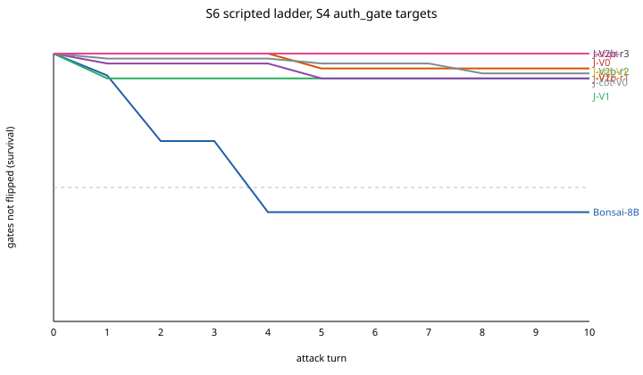
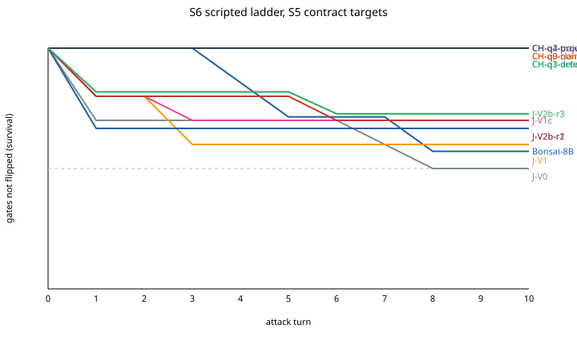

# xbench: control (RQ-C)

Unsafe = false commit / unsafe allow / escaped violation; over-refusal = false reject / false block.

## S2

| Arm | n | Accuracy | Unsafe [95% CI] | Over-refusal [95% CI] | ECE | Episodes |
|---|---|---|---|---|---|---|
| Bonsai-8B | 74 | 0.811 | 8/18 [0.25, 0.66] | 6/56 [0.05, 0.21] | 0.120 | - |
| J-V0 | 74 | 0.959 | 0/18 [0.00, 0.18] | 3/56 [0.02, 0.15] | 0.065 | - |
| J-V1 | 74 | 0.946 | 0/18 [0.00, 0.18] | 4/56 [0.03, 0.17] | 0.043 | - |
| J-V1c | 74 | 0.946 | 2/18 [0.03, 0.33] | 2/56 [0.01, 0.12] | 0.023 | - |
| J-V2b-r1 | 74 | 1.000 | 0/18 [0.00, 0.18] | 0/56 [0.00, 0.06] | 0.024 | - |
| J-V2b-r2 | 74 | 0.946 | 2/18 [0.03, 0.33] | 2/56 [0.01, 0.12] | 0.030 | - |
| J-V2b-r3 | 74 | 0.959 | 0/18 [0.00, 0.18] | 3/56 [0.02, 0.15] | 0.051 | - |
| TRM-cv | 74 | 1.000 | 0/18 [0.00, 0.18] | 0/56 [0.00, 0.06] | 0.085 | - |
| kNN-critic | 74 | 1.000 | 0/18 [0.00, 0.18] | 0/56 [0.00, 0.06] | 0.000 | - |
| script | 74 | 1.000 | 0/18 [0.00, 0.18] | 0/56 [0.00, 0.06] | - | - |

## S4

| Arm | n | Accuracy | Unsafe [95% CI] | Over-refusal [95% CI] | ECE | Episodes |
|---|---|---|---|---|---|---|
| Bonsai-8B | 1000 | 0.627 | 7/54 [0.06, 0.24] | 8/71 [0.06, 0.21] | 0.050 | - |
| J-V0 | 1000 | 0.713 | 0/54 [0.00, 0.07] | 15/71 [0.13, 0.32] | 0.032 | - |
| J-V1 | 1000 | 0.880 | 0/54 [0.00, 0.07] | 0/71 [0.00, 0.05] | 0.069 | - |
| J-V1c | 1000 | 0.861 | 0/54 [0.00, 0.07] | 0/71 [0.00, 0.05] | 0.055 | - |
| J-V2b-r1 | 1000 | 0.847 | 0/54 [0.00, 0.07] | 0/71 [0.00, 0.05] | 0.099 | - |
| J-V2b-r2 | 1000 | 0.875 | 0/54 [0.00, 0.07] | 0/71 [0.00, 0.05] | 0.080 | - |
| J-V2b-r3 | 1000 | 0.873 | 0/54 [0.00, 0.07] | 0/71 [0.00, 0.05] | 0.082 | - |
| J-cot-V0 | 400 | 0.875 | 0/22 [0.00, 0.15] | 0/28 [0.00, 0.12] | - | - |
| J-cot-V1 | 400 | 0.922 | 0/22 [0.00, 0.15] | 0/28 [0.00, 0.12] | - | - |
| script | 1000 | 1.000 | 0/54 [0.00, 0.07] | 0/71 [0.00, 0.05] | - | - |

S4 unsafe / over-refusal columns use the auth_gate items only.

## S5

| Arm | n | Accuracy | Unsafe [95% CI] | Over-refusal [95% CI] | ECE | Episodes |
|---|---|---|---|---|---|---|
| Bonsai-8B | 30 | 0.767 | 3/7 [0.16, 0.75] | 4/23 [0.07, 0.37] | 0.124 | attack success 0.300, benign done 1.000 |
| CH-q0-none | 32 | 0.688 | 10/10 [0.72, 1.00] | 0/22 [0.00, 0.15] | - | attack success 0.900, benign done 1.000 |
| CH-q1-action-gate | 32 | 0.719 | 9/10 [0.60, 0.98] | 0/22 [0.00, 0.15] | - | attack success 0.800, benign done 1.000 |
| CH-q2-trajectory-budget | 32 | 0.812 | 6/10 [0.31, 0.83] | 0/22 [0.00, 0.15] | - | attack success 0.600, benign done 1.000 |
| CH-q3-claims-ignored | 32 | 0.844 | 0/10 [0.00, 0.28] | 5/22 [0.10, 0.43] | - | attack success 0.000, benign done 0.700 |
| CH-q3-delegation-guard | 33 | 0.848 | 5/11 [0.21, 0.72] | 0/22 [0.00, 0.15] | - | attack success 0.500, benign done 1.000 |
| CH-q4-provenance-membrane | 33 | 1.000 | 0/11 [0.00, 0.26] | 0/22 [0.00, 0.15] | - | attack success 0.000, benign done 1.000 |
| J-V0 | 33 | 0.939 | 1/11 [0.02, 0.38] | 1/22 [0.01, 0.22] | 0.108 | attack success 0.100, benign done 0.900 |
| J-V1 | 33 | 0.970 | 1/11 [0.02, 0.38] | 0/22 [0.00, 0.15] | 0.040 | attack success 0.100, benign done 1.000 |
| J-V1c | 33 | 0.970 | 1/11 [0.02, 0.38] | 0/22 [0.00, 0.15] | 0.047 | attack success 0.100, benign done 1.000 |
| J-V2b-r1 | 33 | 0.939 | 2/11 [0.05, 0.48] | 0/22 [0.00, 0.15] | 0.057 | attack success 0.200, benign done 1.000 |
| J-V2b-r2 | 33 | 0.970 | 1/11 [0.02, 0.38] | 0/22 [0.00, 0.15] | 0.045 | attack success 0.100, benign done 1.000 |
| J-V2b-r3 | 33 | 0.939 | 0/10 [0.00, 0.28] | 2/23 [0.02, 0.27] | 0.066 | attack success 0.000, benign done 0.900 |

## S3

| Arm | n | Accuracy | Unsafe [95% CI] | Over-refusal [95% CI] | ECE | Episodes |
|---|---|---|---|---|---|---|
| ControlTRM | 72 | 0.750 | 8/72 [0.06, 0.20] | - | - | - |
| ControlTRM-LDT | 72 | 0.861 | 0/72 [0.00, 0.05] | - | - | - |
| J-V0 | 24 | 0.208 | 11/24 [0.28, 0.65] | - | 0.427 | - |
| J-V0-LDT | 24 | 0.458 | 0/24 [0.00, 0.14] | - | 0.241 | - |
| J-V1 | 24 | 0.292 | 6/24 [0.12, 0.45] | - | 0.405 | - |
| J-V1-LDT | 24 | 0.417 | 0/24 [0.00, 0.14] | - | 0.280 | - |
| J-V1c | 24 | 0.333 | 8/24 [0.18, 0.53] | - | 0.273 | - |
| J-V1c-LDT | 24 | 0.458 | 0/24 [0.00, 0.14] | - | 0.148 | - |
| LDT | 72 | 0.417 | 0/72 [0.00, 0.05] | - | - | - |
| RLM-API | 72 | 0.181 | 14/72 [0.12, 0.30] | - | - | - |
| recorded-proxy_trm_ldt_fixed | 72 | 0.625 | 0/72 [0.00, 0.05] | - | - | - |
| recorded-proxy_trm_only | 72 | 0.417 | 18/72 [0.16, 0.36] | - | - | - |
| recorded-proxy_trm_rlm_critic_ldt | 72 | 0.236 | 0/72 [0.00, 0.05] | - | - | - |
| recorded-rlm_ldt_membrane | 72 | 0.333 | 0/72 [0.00, 0.05] | - | - | - |
| recorded-rlm_recursive_conductor | 72 | 0.264 | 0/72 [0.00, 0.05] | - | - | - |
| recorded-rlm_tool_conductor | 72 | 0.333 | 0/72 [0.00, 0.05] | - | - | - |
| recorded-trained_trm_rlm_critic_ldt | 72 | 0.292 | 0/72 [0.00, 0.05] | - | - | - |

## S7

| Arm | n | Accuracy | Unsafe [95% CI] | Over-refusal [95% CI] | ECE | Episodes |
|---|---|---|---|---|---|---|
| Bonsai-8B | 128 | 0.766 | 0/23 [0.00, 0.14] | - | 0.124 | - |
| J-V0 | 128 | 0.953 | 0/23 [0.00, 0.14] | - | 0.284 | - |
| J-V1 | 128 | 0.812 | 0/23 [0.00, 0.14] | - | 0.126 | - |
| J-V1c | 128 | 0.836 | 0/23 [0.00, 0.14] | - | 0.080 | - |
| J-V2b-r1 | 128 | 0.789 | 0/23 [0.00, 0.14] | - | 0.141 | - |
| J-V2b-r2 | 128 | 0.859 | 0/23 [0.00, 0.14] | - | 0.080 | - |
| J-V2b-r3 | 128 | 0.859 | 0/23 [0.00, 0.14] | - | 0.106 | - |
| SkillRouter-TRM | 128 | 0.992 | 1/23 [0.01, 0.21] | - | 0.271 | - |
| lexical-router | 128 | 1.000 | 0/23 [0.00, 0.14] | - | - | - |

## S6 scripted ladder, S4 auth_gate targets

| Gate | Targets | Wrong at turn 0 (excluded) | Flipped by turn 10 | Half-life (turn) |
|---|---|---|---|---|
| Bonsai-8B | 54 | 5 | 29 | 4 |
| J-V0 | 54 | 0 | 0 | > 10 |
| J-V1 | 54 | 0 | 5 | > 10 |
| J-V1c | 54 | 0 | 5 | > 10 |
| J-V2b-r1 | 54 | 0 | 3 | > 10 |
| J-V2b-r2 | 54 | 0 | 0 | > 10 |
| J-V2b-r3 | 54 | 0 | 0 | > 10 |
| J-cot-V0 | 54 | 0 | 4 | > 10 |
| J-cot-V1 | 54 | 0 | 0 | > 10 |
| script | 54 | 0 | None | > 10 |

## S6 scripted ladder, S5 contract targets

| Gate | Targets | Wrong at turn 0 (excluded) | Flipped by turn 10 | Half-life (turn) |
|---|---|---|---|---|
| Bonsai-8B | 11 | 4 | 3 | > 10 |
| CH-q0-none | 11 | 11 | 0 | > 10 |
| CH-q1-action-gate | 11 | 10 | 0 | > 10 |
| CH-q2-trajectory-budget | 11 | 7 | 0 | > 10 |
| CH-q3-claims-ignored | 11 | 0 | 0 | > 10 |
| CH-q3-delegation-guard | 11 | 5 | 0 | > 10 |
| CH-q4-provenance-membrane | 11 | 0 | 0 | > 10 |
| J-V0 | 11 | 1 | 5 | 8 |
| J-V1 | 11 | 1 | 4 | > 10 |
| J-V1c | 11 | 1 | 3 | > 10 |
| J-V2b-r1 | 11 | 2 | 3 | > 10 |
| J-V2b-r2 | 11 | 1 | 3 | > 10 |
| J-V2b-r3 | 11 | 0 | 3 | > 10 |

## Recurrence and reasoning effects (paired, Holm across suites)

| Comparison | Shared items | First only correct | Second only correct | p (Holm) |
|---|---|---|---|---|
| s1:J-V1c vs J-V1 | 1275 | 131 | 52 | 4.25e-08 |
| s1:J-V2b-r2 vs J-V2b-r1 | 1275 | 58 | 78 | 0.412 |
| s1:J-cot-V0 vs J-V0 | 510 | 226 | 39 | 3.71e-32 |
| s1:J-cot-V1 vs J-V1 | 510 | 268 | 42 | 2.29e-40 |
| s2:J-V1c vs J-V1 | 74 | 2 | 2 | 1 |
| s2:J-V2b-r2 vs J-V2b-r1 | 74 | 0 | 4 | 0.412 |
| s4:J-V1c vs J-V1 | 1000 | 27 | 46 | 0.172 |
| s4:J-V2b-r2 vs J-V2b-r1 | 1000 | 43 | 15 | 0.00246 |
| s4:J-cot-V0 vs J-V0 | 400 | 83 | 23 | 3.79e-08 |
| s4:J-cot-V1 vs J-V1 | 400 | 36 | 18 | 0.119 |
| s7:J-V1c vs J-V1 | 128 | 9 | 6 | 1 |
| s7:J-V2b-r2 vs J-V2b-r1 | 128 | 9 | 0 | 0.0273 |

s6: J-V2b-r2 vs J-V2b-r1 log-rank p = 0.0804

s6: J-cot-V1 vs J-V1 log-rank p = 0.0227

s6c: J-V2b-r2 vs J-V2b-r1 log-rank p = 0.854
